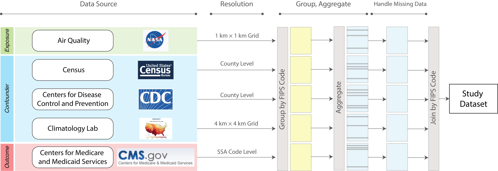

# Synthetic Medicare Data for Environmental Health Studies

Author: Naeem Khoshnevis, Xiao Wu, Danielle Braun

## Summary

We present steps to generate public data sets for benchmarking and illustration purposes for air pollution and health studies. In most of these studies, the health care data cannot be shared with the public; as a result, there are no public data sets to be used as benchmark data set for testing the packages or illustrating their functionalities.  CMS has generated synthetic data for the 2008-2010 range for Medicare data. This report uses these data, census, and exposure data to compile the study data set. 




## Set up project environment

In order to be able to reproduce the results. You need to download raw data. All data are open to the public. The raw data is large (> 7 GB), as a result we seperate code and data. Input files are shared [here](https://drive.google.com/drive/folders/1t8x0hQ_oHuuXV_Hr-1l9jpjjaWcry2qw?usp=sharing) for direct download. There are several helper functions and codes to setup the environmental path on your system (Windows is not tested.). Please note that this is different than processing environment. 

- Step 1: Create a `project_path_info.md` file and add the following fields:

```sh
PROJECT_NAME=your_project_name
PUBLIC_DATA_DIR=path_to_public_data_folder_on_your_system
PRIVATE_DATA_DIR=path_to_private_data_folder_on_your_system
OUTPUT_DATA_DIR=path_to_output_folder_on_your_system
```

- Step 2: Run `initialize_project.sh`
- Step 3: Copy downloaded files under public directory.
- Step 4: TODO: Activate r conda environment.
- Step 5: Run `run_this.R`

